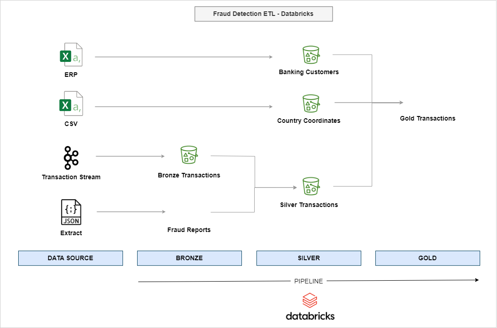

# Fraud Detection ETL with Databricks

## Project Description

**Objective/Goal**:
- Develop a robust ETL pipeline to process and analyze transaction data for fraud detection using Databricks.

**Sector**:
- Finance 

**Technologies Used**:
- **Databricks**: Used for orchestrating the ETL pipeline and managing Delta Lake.
- **Apache Spark**: Powers the data transformation processes.
- **Delta Lake**: Used for data storage and management, ensuring ACID transactions.
- **AWS S3**: Utilized for the storage of raw and processed data.
- **PySpark**: For processing data in a distributed manner.

## Data Source, Transformation & Output

**Architecture Overview**:
- The project uses a multi-layered architecture approach involving Bronze, Silver, and Gold layers for staged data processing. 

**Data Sources**:
- Mock data are sourced from Databricks' demo content but processed in a unique manner to suit the project requirements. [Data](https://notebooks.databricks.com/demos/lakehouse-fsi-fraud/00-FSI-fraud-detection-introduction-lakehouse.html) includes transactions history, customer profiles, and fraud reports. 

**Transformation Steps**:
- **Bronze Layer**: Raw data ingestion from JSON and CSV formats.
- **Silver Layer**: Data cleaning, including schema validation and deduplication.
- **Gold Layer**: Data enrichment, joining various datasets to provide a holistic view necessary for fraud detection.

**Output**:
- The processed data in the Gold layer is outputed in S3. You can view the outputs at [S3 Files](./S3%20Files/)

## Pipeline & Email

- The project includes a pipeline that processes transaction data across three stages: Bronze, Silver, and Gold. Each stage corresponds to a specific notebook within the pipeline that handles different aspects of the ETL process.
  
- **Pipeline Overview**: Shows the sequence of notebooks scheduled to run - Bronze, Silver, and Gold layers.
  

- **Pipeline Run**: Demonstrates the actual execution of the pipeline, displaying the time taken and successful completion of all three steps.
  

- At the completion of the pipeline's execution, an automated email notification is sent to stakeholders, confirming the successful processing and readiness of the data for fraud detection analysis.
  
- 

## Results

- The pipeline efficiently processes and enriches transaction data.

## Learnings

- Gained insights into building scalable ETL pipelines using cloud technologies.
